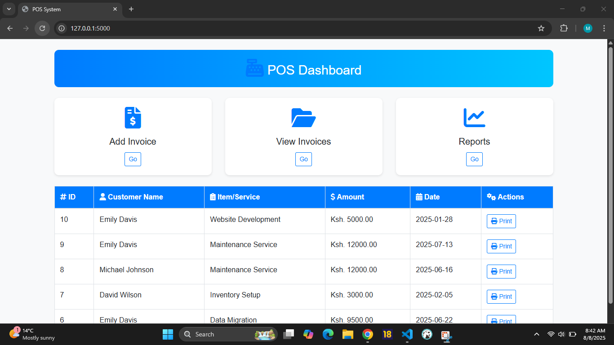
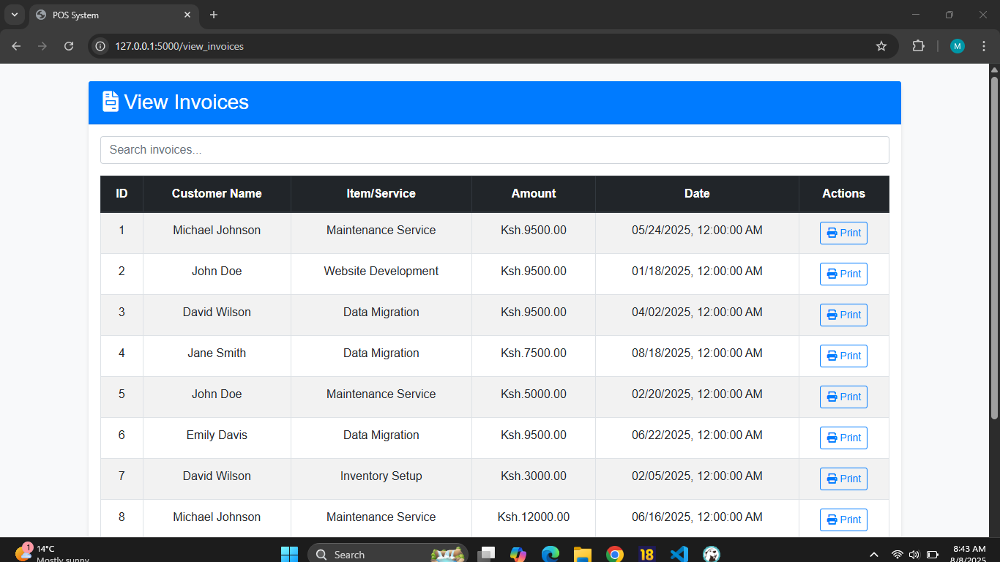
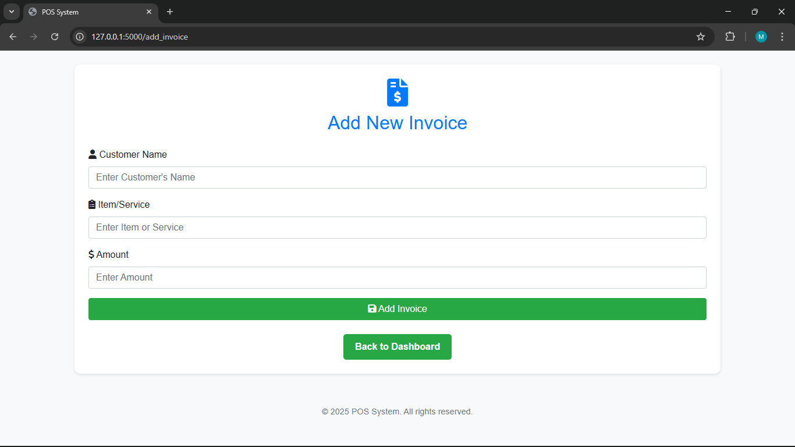

# Invoice Management System (Flask)

A simple Flask-based invoice management web app with:

- Invoice creation
- Invoice listing
- Printable invoices
- Dashboard and reporting

## Features

- Add, view, and print invoices
- Dashboard with summary reports
- SQLite database (via SQLAlchemy)
- Clean UI with basic CSS styling

## Screenshots

### Dashboard



### Invoice List



### Add Invoice



## Installation

1. **Clone the repo**
   ```bash
   git clone https://github.com/MaswiliK/invoice-app.git
   cd invoice-app
   ```
2. pip install -r requirements.txt

## Usage

python app.py
